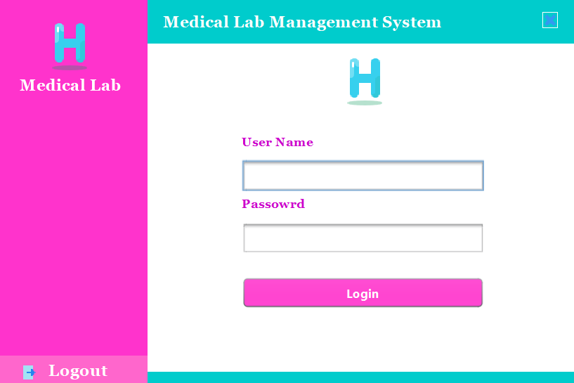
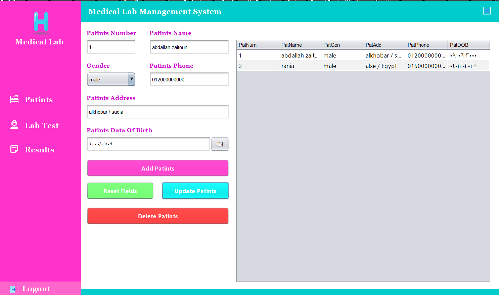

# 🏥 Medical Lab Desktop Application

  
  
  

---

## ✨ About the Project
This is a **Java Desktop Application** designed for **medical laboratories** to manage patient tests, track results, and organize lab data efficiently.  
The application provides a **user-friendly interface** and **robust functionalities** for lab staff to streamline daily operations.

---

## 🛠 Features
- Add, edit, and delete patient records.
- Record and manage lab test results.
- Generate reports for patients and lab tests.
- Search and filter patients by ID, name, or test.
- Secure and easy-to-use desktop interface.

---

## 💻 Technologies Used
- **Language:** Java  
- **Platform:** Desktop Application  
- **IDE:** NetBeans  
- **Database:** MySQL 
- **GUI Framework:** Swing

---

## 🔗 Screenshots

  
  

---

## ⚡ Usage
- Launch the application.  
- Navigate through menus to add patients and tests.  
- Use search functionality to find records quickly.  
- Generate reports for printing or exporting.

---

## 📫 Contact
For questions or support, contact **Abdallah Zaitoun**:  
- Email: `abdallahzaytoon42@gmail.com`  
- LinkedIn: [Abdallah Zaitoun](https://www.linkedin.com/in/abdallah-zaitoun-133754348)
